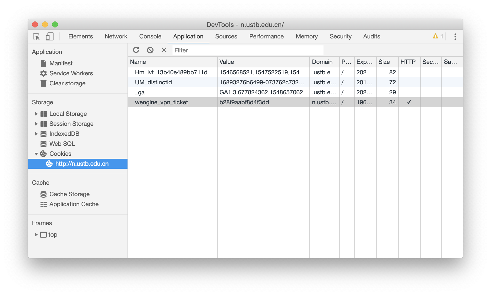
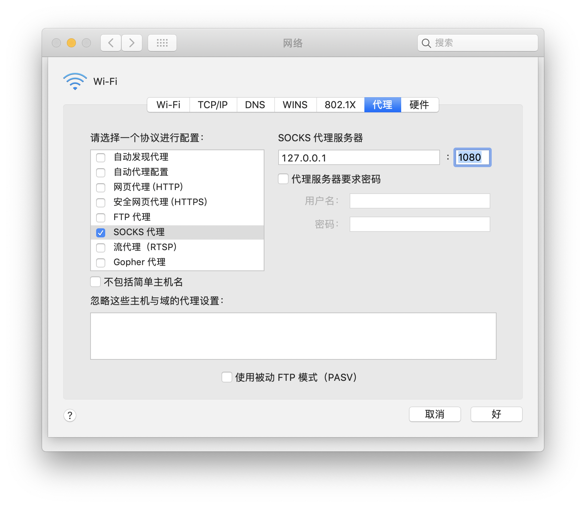

> 从校外网络访问USTB校内网络

## 使用示例:服务端
 在内网的服务端的主机(如地址为`proxy.gensh.me`的主机)上执行:
 ```bash
 # For instance, listener on port 80.
 # And make sure your port has been added to the white list of your firewall.
 wssocks server --addr :80
 ```
 例如上面的命令，在服务端监听80端口(或者是别的端口,但client端`remote`选项需要和其相一致)。另外，需要确保你监听的端口已经被添加到主机防火墙的白名单列表中。

 see more: https://github.com/genshen/wssocks#server-side.

## 使用示例:客户端
1. 登录 n.ustb.edu.cn;

2. 打开浏览器的 DevTools (以chrome为例), 获得当前页面(登录成功的n.ustb.edu.cn)的cookie, 主要是名为`wengine_vpn_ticket`的cookie;

**声明**: 服务器端不会保存任何用户信息, 所有的信息(如cookie)均保存中用户客户端主机中。  

3. 打开命令行,执行如下命令:
   > 下面命令中, `wssocks-ustb`可执行程序均指代包含`wssocks-plugin-ustb`插件功能的`wssocks`程序.
   ```bash
   # macOS, linux
   USTB_VPN=ON VPN_COOKIE=wengine_vpn_ticket=b28f9aabf8d4f3dd wssocks-ustb client --addr :1080 --remote ws://proxy.gensh.me
   # windows powershell
   $env:USTB_VPN='ON'; $env:VPN_COOKIE='wengine_vpn_ticket=b28f9aabf8d4f3dd'; wssocks-ustb client --addr :1080 --remote ws://proxy.gensh.me
   ```
   这里，设置了两个环境变量`USTB_VPN`与`VPN_COOKIE`, 分别说明当前环境是需要通过n.ustb.edu.cn连接校内网络的以及设置n.ustb.edu.cn网站的cookie。  
   此外，客户端本地监听地址为`:1080`(即0.0.0.0:1080), 服务器端地址为`ws://proxy.gensh.me`。

4. 设置代理  
使用socks代理客户端软件(如mac系统的全局代理功能), 设置代理地址。

在mac中，勾选**socks代理**选项框, 并填入代理服务器的地址及端口(即wssocks客户端本地监听地址及端口)，保存生效。  
如果你使用的是windows, 可以使用[Proxifier](https://www.proxifier.com/)软件。

5. 访问网页  
直接在浏览器地址栏输入对应的地址即可访问，即可访问校内网络,不用任何特殊设置。

6. ssh连接(仅macOS)
   ```bash
   ssh -o ProxyCommand='nc -x 127.0.0.1:1080 %h %p' ssh.hpc.gensh.me
   ```
     
   windows和linux中可直接使用类似的`ssh ssh.hpc.gensh.me`命令。

7. git 命令(仅macOS)
   ```bash
   GIT_SSH_COMMAND="ssh -o ProxyCommand='nc -x 127.0.0.1:1080 %h %p' " git clone repo_address
   ```
   windows和linux中可直接使用类似的`git clone repo_address`命令。

8. 其他终端操作(仅macOS)
   ```bash
   export all_proxy=socks5://127.0.0.1:1080
   git clone repo_address # git clone, 效果同 7.
   ssh ssh.hpc.gensh.me # ssh 连接, 效果同6.
   ```
